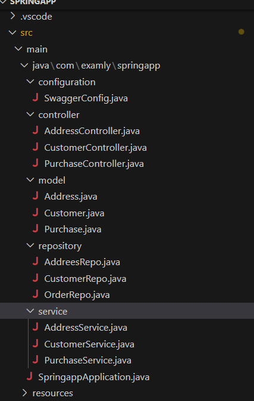

Project Question
Overview:

Develop a Spring Boot application that manages three entities: "Customer", "Address", and "Purchase". A Customer can have multiple "Purchase", and each "Address" can be associated with only one "Customer". Implement one-to-many bidirectional mapping between "Customer" and "Purchase" entities and one-to-one bidirectional mapping between "Customer" and "Address" entities using Spring Data JPA and demonstrate the usage of Swagger for API documentation and interaction.

Functional Requirements:

Create folders named controller, model, repository and service inside the WORKSPACE/springapp/src/main/java/com/examly/springapp.

Inside controller folder, create classes named "CustomerController”, "AddressController" and "PurchaseController".

Inside model folder,

Create a class named "Customer" with the following attributes:

customerId - int
firstName - String
lastName - String
address - Address (OneToOne, mappedBy = "customer")
purchase - List<Purchase> (OneToMany, mappedBy = "customer", Use @JsonIgnore annotation for getPurchaseOrders())
Create a class named "Address" with the following attributes:

addressId - int
street - String
city - String
zipCode - String
customer - Customer (OneToOne, Use @JsonIgnore for getAddress())
Create another class named "Purchase" with the following attributes:

orderId - int
productName - String
quantity - int
price - double
customer - Customer (ManyToOne, fetch=FetchType.Eager)
Implement getters, setters and constructors for the Address, Customer and Purchase entities.

Inside repository folder, create interfaces named “AddressRepo”, "CustomerRepo" and "PurchaseRepo".

Inside service folder, create classes named "AddressService", "CustomerService" and "PurchaseService".

Inside configuration folder, create a class named "SwaggerConfig" to implement Swagger functionality.

Annotate SwaggerConfig class with @Configuration and @EnableSwagger2 to implement Swagger functionality.

Refer to the below image for the project structure:

API ENDPOINTS:

API endpoints for Customer:

POST - "/customer" - Returns response status 201 with customer object on successful creation which includes log info message "POST Request received for /customer with data: objdata" is logged, where "objdata" represents the posted customer data or else 500.

GET - "/customer/{customerId}" - Returns response status 200 with customer object, where customer object includes associated purchase details on successful retrieval which includes the log info message "GET Request received for /customer/customerId" is logged, where "customerId" represents the customer's id or else 500.

GET - "/customer/findByFirstname/{firstName}" - Returns status code 200 with List<Customer> objects, including the details of associated purchase objects that are filtered by specified firstName. The value is passed in the request parameter key as 'firstName'.

GET - "/customer/startswith/{firstName}" - Retrieves List<Customer> objects, including the details of associated purchase objects that starts with specified firstName and have a status code of 200 or else 500.

GET - "/customer/{pageNo}/{pageSize}" - Returns a response with a status code of 200. It should include a List<Customer> object sorted in descending order by the firstName attribute. Each customer object returned should include associated purchase details. The 'pageNo' parameter denotes the starting index of the page, while 'pageSize' represents the number of customers per page. In case of successful retrieval, it should return the response as described, otherwise, it should return a 500 status code.

API endpoints for Address:

POST - "/address/{customerId}" - Returns response status 201 with address object on successful mapping of the customer object to the specified customerId or else 500.

GET - "/address/{addressId}" - Returns response status 200 with address object on successful retrieval or else 500.

GET - "/address" - Returns response status 200 with List<Address> object in ascending order by using city on successful retrieval or else 500.

GET - "/address/endswith/{city}" - Retrieves List<Address> that ends with a specified city and have a status code of 200 or else 500.

PUT - "/address/{addressId}" - Returns response status 200 with address object on successful updation or else 404. All fields of the address object are modifiable except for the "addressId".

DELETE - "/address/{addressId}" - Returns response status 200 with String "Address deleted Successfully" on successful deletion or else "Address Not found".

API endpoints for Purchase:

POST - "/customer/{customerId}/purchase" - Returns response status 201 with purchase object on successful mapping of the purchase object to the specified customerId or else 500.

GET - "/customer/purchase" - Returns response status 200 with List<Purchase> object on successful retrieval or else 404.

GET - "/customer/purchase/{orderId}" - Returns response status 200 with purchase object on successful retrieval or else 500.

GET - "/customer/purchase/findbyproductname/{productName}" - Retrieves List<Purchase> that are filtered by specified productName and have a status code of 200 or else 500.

DELETE - "/customer/purchase/{orderId}" - Returns response status 200 with String "Order deleted successfully" on successful deletion or else "Order not found".

Note:

Do not modify the application.properties and pom.xml files. If you change there may be build failure and the test case will fail. Follow the naming convention as specified.

API endpoint:

8080

Platform Guidelines:

To run the project use Terminal in the platform.

Spring Boot:

Navigate to the springapp directory => cd springapp

To start/run the application 'mvn spring-boot:run'

To Connect the Database Open the terminal

mysql -u root --protocol=tcp -p

password:examly

NOTE:

Before executing the test case, ensure that the database is dropped.

Click on the Run Test Case button to pass all the test cases
