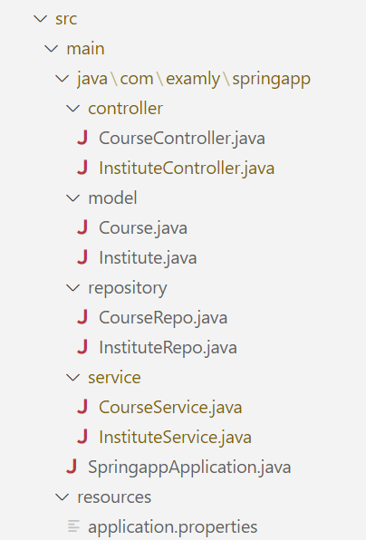

Project Question
Overview:

Create a Spring Boot application with two entities: 'Institute' and 'Course'. Establish a One-to-Many bidirectional mapping between the 'Institute' and 'Course' entities using Spring Data JPA, allowing multiple courses to be associated with a single institute.

Functional Requirements:

Create folders named controller, model, repository and service inside the WORKSPACE/springapp/src/main/java/com/examly/springapp.

Inside controller folder, create classes named "InstituteController” and "CourseController".

Inside model folder,

Create a class named "Institute" with the following attributes

instituteId - int
instituteName - String
instituteDescription - String
instituteAddress - String
email - String
contactNumber - String
courses - List<Course> (OneToMany, mappedBy = "institute" and use @JsonIgnore annotation for getCourses() method )
Create another class named "Course" with the following attributes

courseId - int
courseName - String
courseDescription - String
courseDuration - String
courseFees - double
noOfSeats - int
institute - Institute (ManyToOne)
Implement getters, setters and constructors for the Institute and Course entities.

Inside repository folder, create interfaces named “InstituteRepo” and "CourseRepo".

Inside service folder, create classes named "InstituteService" and "CourseService".

Refer to the below image for the project structure:

API ENDPOINTS:

API endpoints for Institute:

POST - "/api/institute" - Returns response status 201 with institute object on successful creation or else 500.

POST - "/api/institute/{instituteId}/course" - Returns response status 201 with course object, including the details of associated institute object on successful mapping of the course object to the specified instituteId or else 500.

GET - "/api/institute" - Returns response status 200 with List<Institute> object on successful retrieval or else 404.

PUT - "/api/institute/{instituteId}" - Returns response status 200 with updated institute object on successful updation or else 500. All fields present in the institute object are modifiable except "instituteId" field.

API endpoints for Course:

GET - "/api/institute/{instituteId}/course" - Returns response status 200 with List<Course> objects filtered by instituteId, where each course object includes associated institute details on successful retrieval or else 404.

GET - "/api/institute/course" - Returns response status 200 with a List<Course> objects, where each course object includes associated institute details on successful retrieval or else 404.

GET - "/api/institute/course/{courseId}" - Returns response status 200 with course object, where course object includes associated institute details on successful retrieval or else 404.

PUT - "/api/institute/course/{courseId}" - Returns response status 200 with updated course object which includes associated institute object details on successful updation or else 500. All fields present in the course object are modifiable except "courseId" field.

DELETE- "api/institute/course/{courseId}" - Returns response status 200 with String "Course deleted Successfully" on successful deletion or else returns 404 with String "Course not found".
