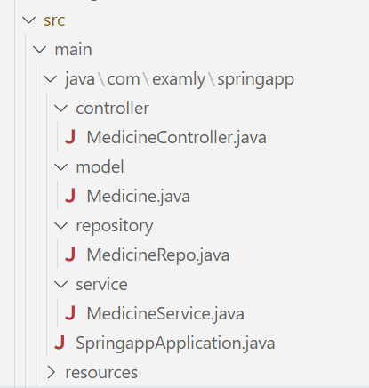

# Project Question

## Overview:

Build a web application that facilitates CRUD operations for managing Medicine details using JPQL via REST APIs.

## Functional Requirements:

- Create folders named as controller, model, repository and service inside the WORKSPACE/springapp/src/main/java/com/examly/springapp.

- Inside controller folder, create a class named "MedicineController".

- Inside model folder, create a class named "Medicine" with the following attributes:
  ```
  medicineId - int
  name - String
  brand - String
  manufacturedIn - String  
  price - double
  expiryDate - Date
  ```
  
- Implement getters, setters and constructors for the corresponding attributes.

- Inside repository folder, create an interface named "MedicineRepo".

- Inside the MedicineRepo, utilize the @Query annotation to implement the PUT and DELETE operations.

- Inside service folder, create a class file named "MedicineService".

## Refer the below image for the project structure:



### API Endpoints:

`POST - /api/medicine` - Returns response status 201 with medicine object on successful creation or else 500.

`PUT - /api/medicine/{medicineId}` - Returns response status 200 with updated medicine object, on successful updation or else 404. The @Query annotation is utilized to modify only the "price" field.

`DELETE - /api/medicine/expired` - Returns response status 200 with String "Deleted Successfully" on successful deletion or else returns 404 with String "No medicine found in expired state". The @Query annotation is utilized to delete the medicines whose expiryDate is before the current date.

`GET - /api/medicine` - Returns response status 200 with List<Medicine> object on successful retrieval or else 404.

`GET - /api/medicine/bybrand/{brand}` - Returns response status 200 with List<Medicine> object filtered by brand on successful retrieval or else 404.
