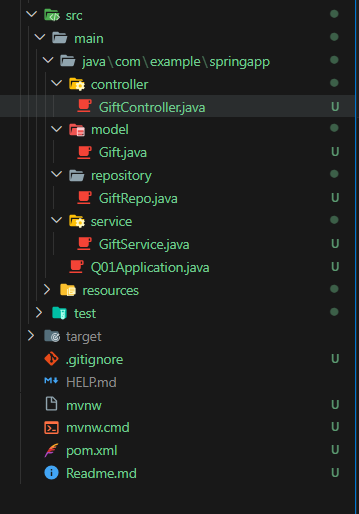

# Project Question

## Overview:

Build a web application that facilitates POST and GET operations for managing gift details via RESTful APIs.

## Functional Requirements:

- Create folders named as controller, model, repository, service inside `WORKSPACE/springapp/src/main/java/com/example/springapp.`

- Inside controller folder, create a class named “GiftController”.

- Inside model folder, create a class named "Gift" with the following attributes:

  ```
  giftId - int
  giftName - String
  description - String
  price - String
  category - int
  ```

- Implement getters, setters and constructors for the corresponding attributes.

- Inside repository folder, create an interface named “GiftRepo”.

- Inside the service folder, create a class named “GiftService”.

## Refer the below image for the project structure:



### API Endpoints:

- `POST - "/api/gift"` - Returns response status 201 with gift object on successful creation or else 500.

- `GET - "/api/gift"` - Returns response status 200 with List<Gift> object on successful retrieval or else 404.

- `GET - "/api/gift/{giftId}"` - Returns response status 200 with gift object on successful retrieval or else 404.
