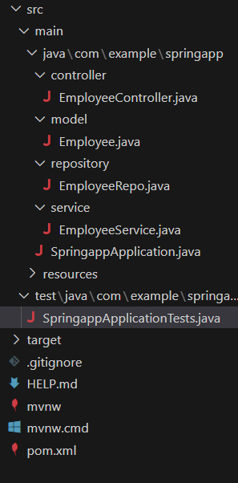

# Project Question

## Overview:

Build a web application that facilitates POST and GET operations for managing employee details via RESTful APIs.

> ⚠️ **NOTE:** The testcase will not pass normally. After passing first three testcase follow this to pass the remaining testcase [how-to-pass-testcase](how-to-pass-testcase.md).

## Functional Requirements:

- Create a folders named as controller, model, repository and service the WORKSPACE/springapp/src/main/java/com/example/springapp

- Inside controller folder, create a class file named “EmployeeController.java”.

- Inside model folder, create a class named Employee with the following attributes:

  ```java
  employeeId - int
  firstName - String
  lastName - String
  email - String
  phoneNumber - String
  address - String
  city - String
  hireDate - Date
  ```

- Implement getters, setters and constructors for the corresponding attributes.

- Inside repository folder, create a interface named “EmployeeRepo”.

- Inside service folder, create a class named “EmployeeService”.

Refer the below image for the project structure:


## API Endpoints:

- `POST - "/api/employee"` --> returns response status 201 with employee object on successful creation or else 500.

- `GET - "/api/employees"` --> returns response status 200 with List <Employee > object on successful reterival or else 404.

- `GET - "/api/employee/{employeeId}"` --> returns response status 200 with employee object on successful reterival or else 404.

### Note:

Do not modify the `application.properties` and `pom.xml` files. If you change there may be build failure and the test case will fail. Follow the naming convention as specified above.

## API endpoint:

8080

## Platform Guidelines:

To run the project use Terminal in the platform.

## Spring Boot:

Navigate to the springapp directory => `cd springapp`

To start/run the application `'mvn spring-boot:run'`

### To Connect the Database Open the terminal

```sh
mysql -u root --protocol=tcp -p
password:examly
```

**Note: Drop database before running test case**

Click on the Run Test Case button to pass all the test cases
