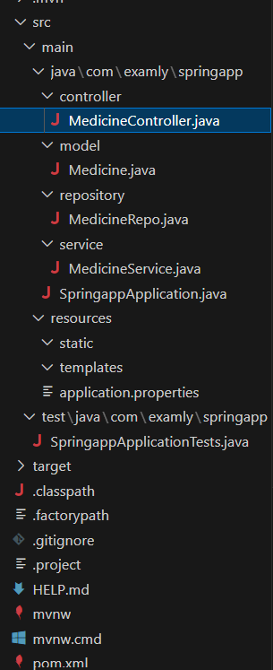

# Project Question

## Overview:

Build a web application that facilitates POST and GET  operations for managing medicine details via RESTful APIs.


## Functional Requirements:

Create  folders named as controller, model, repository and service inside the `WORKSPACE/springapp/src/main/java/com/examly/springapp`.

Inside controller folder, create a class named `“MedicineController.java”`.

Inside model folder, create a class named Medicine with the following attributes:

```
medicineId - int
medicineName - String
medicineFor - String
medicineBrand - String
manufacturedIn - String
medicinePrice - double
expiryDate - String
```

 Implement getters, setters and constructors for the corresponding attributes.

 Inside repository folder, create an interface named “MedicineRepo”.

 Inside service folder, create a class file named “MedicineService”.


Refer the below image for the project struture:




### API Endpoints:

`POST - "/api/medicine"` --> returns response status 201 with medicine object on successful creation or else 500. 

`GET - "/api/medicines"` -->    returns response status 200 with List <Medicine> object on successful reterival or else 404.

`GET - "/api/medicine/{medicineId}"` -->   returns response status 200 with medicine object on successful reterival or else 404.


### Note:

Do not modify the `application.properties` and `pom.xml` files. If you change there may be build failure and the test case will fail. Follow the naming convention as specified above.


### API endpoint:

8080


### Platform Guidelines:

To run the project use Terminal in the platform.


### Spring Boot:

Navigate to the springapp directory => `cd springapp`

To start/run the application `'mvn spring-boot:run'`


To Connect the Database Open the terminal

```sh
mysql -u root --protocol=tcp -p
```

**password:** examly


**Note:** Drop database before running test case


Click on the Run Test Case button to pass all the test cases

