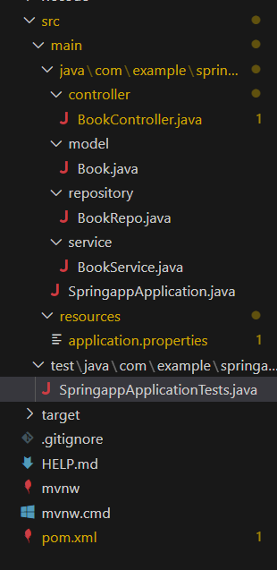

# Project Question

## Overview:

Build a web application that facilitates POST and GET  operations for managing book details via RESTful APIs.


## Functional Requirements:       

Create a folders named as controller, model, repository, service the `WORKSPACE/springapp/src/main/java/com/example/springapp`.

- Inside  controller folder, create a class named  “BookController”.

- Inside model folder, create a class named Book with the following attributes:

    ```java
    bookId - int
    bookName - String
    author - String
    price - int
    ```

- Implement getters, setters and constructors for the corresponding attributes.

- Inside repository folder, create interface named “BookRepo”.

- Inside the servcie folder, create a class named “BookService”.


**Refer the below image for the project structure:**




### API Endpoints:

1. `POST - "/api/book"` --> returns response status 201 with book object on successful creation or else 500. 

2. `GET - "/api/book"` -->    returns response status 200 with List<Book> object on successful reterival or else 404.

3. `GET - "/api/book/{bookId}"` -->   returns response status 200 with book object on successful reterival or else 404.


### Note:

Do not modify the `application.properties` and `pom.xml` files. If you change there may be build failure and the test case will fail. Follow the naming convention as specified above.


## API endpoint:

8080

## Platform Guidelines:

To run the project use Terminal in the platform.


## Spring Boot:

Navigate to the springapp directory => `cd springapp`

To start/run the application `'mvn spring-boot:run'`


### To Connect the Database Open the terminal

```sh
mysql -u root --protocol=tcp -p
password:examly
```


**Note: Drop database before running test case**


Click on the Run Test Case button to pass all the test cases
