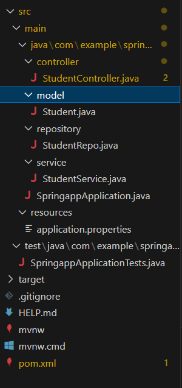

# Project Question

## Overview

Build a web application that facilitates POST and GET operations for pagination and sorting student details via RESTful APIs.

## Functional Requirements:

- Create folders named as controller, model, repository and service inside the WORKSPACE/springapp/src/main/java/com/example/springapp.

- Inside the controller folder, create a class named “StudentController”.

- Inside model folder, create a class named "Student" with the following attributes:

  ```java
  id  - int
  name - String
  age -  int
  city - String
  rollno - String
  ```

- Implement getters, setters and constructors for the corresponding attributes.

- Inside repository folder, create an interface named "StudentRepo".

- Inside service folder, create a class named "StudentService".

### Refer the below image for the project structure:



## API Endpoint

1.  `POST - /api/student` - Returns response status 201 with student object on successful creation or else 500.
1.  `GET - /api/student` - Returns a response status of 200 with a List<Student> object filtered by pageNo and pageSize, which are passed in the request parameters with keys pageNo and pageSize, upon successful retrieval or else 404.
1.  `GET - /api/student/sort` - Returns a response status of 200 with a List<Student> object filtered by pageNo, pageSize, and sortBy, which are passed in the request parameters with keys pageNo, pageSize and sortBy upon successful retrieval or else 404.

### Note:

Do not modify the `application.properties` and `pom.xml` files. If you change there may be build failure and the test case will fail. Follow the naming convention as specified above.

## API endpoint:

8080

## Platform Guidelines:

To run the project use Terminal in the platform.

## Spring Boot:

Navigate to the springapp directory => `cd springapp`

To start/run the application `'mvn spring-boot:run'`

### To Connect the Database Open the terminal

```sh
mysql -u root --protocol=tcp -p
password:examly
```

**Note: Drop database before running test case**

Click on the Run Test Case button to pass all the test cases
