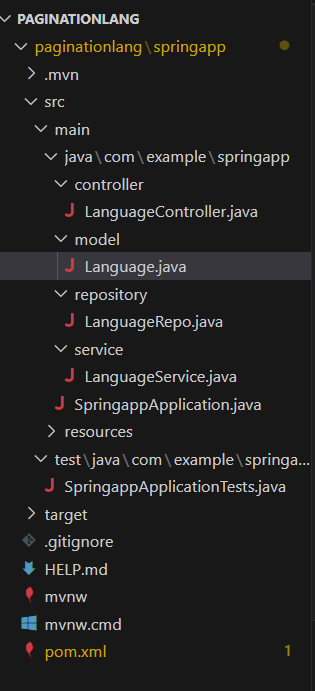

# Project Question

## Overview

Build a web application that facilitates POST and GET operations for pagination and sorting language details via RESTful APIs.

## Functional Requirements:

- Create folders named as controller, model, repository and service inside the WORKSPACE/springapp/src/main/java/com/example/springapp.

- Inside the controller folder, create a class named “LanguageController”.

- Inside model folder, create a class named "Language" with the following attributes:

  ```java
  languageId - int
  languageName - String
  languageCode -  int
  country - String
  ```

- Implement getters, setters and constructors for the corresponding attributes.

- Inside repository folder, create an interface named "LanguageRepo".

- Inside service folder, create a class named "LanguageService".

### Refer the below image for the project structure:



### API Endpoint :

1. `POST -  /api/language` - Returns response status 201 with language object on successful creation or else 500.

1. `GET - /api/language/sortBy/{field}` - Returns response status 200 with List <Language> object, where {field} denotes the attribute name to be sorted in ascending order on successful retrieval or else 404.

1. `GET - /api/language/{offset}/{pagesize}` - Returns response status 200 with List <Language> object, where {offset} denotes the starting index of the page, {pagesize} represents the number of languages per page, on successful retrieval or else 404.

1. `GET - /api/language/{offset}/{pagesize}/{field}` - Returns response status 200 with List<Language> object, where {offset} denotes the starting index of the page, {pagesize} represents the number of languages per page and {field} denotes the attribute name to be sorted in ascending order on successful retrieval or else 404.

### Note:

Do not modify the `application.properties` and `pom.xml` files. If you change there may be build failure and the test case will fail. Follow the naming convention as specified above.

## API endpoint:

8080

## Platform Guidelines:

To run the project use Terminal in the platform.

## Spring Boot:

Navigate to the springapp directory => `cd springapp`

To start/run the application `'mvn spring-boot:run'`

### To Connect the Database Open the terminal

```sh
mysql -u root --protocol=tcp -p
password:examly
```

**Note: Drop database before running test case**

Click on the Run Test Case button to pass all the test cases
